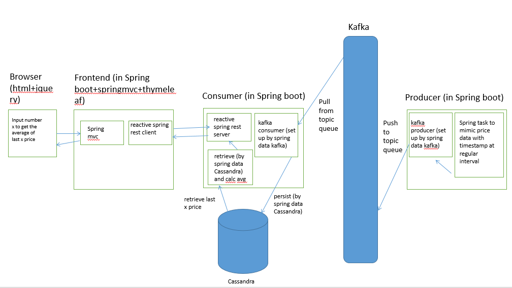

# market-data-project

## Overview

The goal of this mini application is to display the average of the last X prices, with X an input parameter. The user input/output takes place on the web application 1/. Data producer 3/ publishes a continuous series of prices which is received by consumer 2/, which stores them. The consumer 2/ is also a "calculation engine" which processes the user requests.

1/ Web App = User Front-End
- takes in user input X: the number of last prices
- requests the back-end to run the calculation: what is the average value of the last X prices?
- receives the result and displays it
 
2/ Data Consumer = Back-End
- receives the published numbers
- stores them
- responds to user requests with a result
 
3/ Data Producer = 3rd party source
- publishes an arbitrary price time-series (any number with a timestamp) at regular intervals
 
Those 3 components are to be implemented as separate executables/processes.
## Architecture

## Java and maven setup
 This assumes java8+ and maven 3.5+ are setup
 The user/system variables of %JAVA_HOME%, %MVN_HOME%, PATH=%JAVA_HOME%\bin;%MVN_HOME%\bin are setup 
 Eclipse/Intellij are setup to run the modules in IDE (or package those with mvn and run)
## kafka setup
Follow the kafka setup guide at: 
 
 https://dzone.com/articles/kafka-setup
  -- Download ZooKeeper 
   -- Extract the http://apache.01link.hk/zookeeper/zookeeper-3.4.13/zookeeper-3.4.13.tar.gz to C:/dev/softwares/zookeeper-3.4.13
   -- Inside the conf directory, rename the file zoo_sample.cfg to zoo.cfg
   -- In zoo.cfg, change dataDir to  C:/dev/softwares/zookeeper-3.4.13/data
  -- Download Kafka 
   -- Extract https://www.apache.org/dyn/closer.cgi?path=/kafka/2.0.0/kafka_2.12-2.0.0.tgz to C:/dev/softwares/kafka_2.12-2.0.0
   -- Go to the config directory. Open the file server.properties, change logDirs to log.dirs to C:/dev/softwares/kafka_2.12-2.0.0/kafka-logs
   
start zookeeper 

 C:\dev\softwares\zookeeper-3.4.13\zkserver

start kafka 
 cd C:\dev\softwares\kafka_2.12-2.0.0 
 .\bin\windows\kafka-server-start.bat .\config\server.properties

create a topic queue called "test" in kafka (this is only needed once)
 cd C:\dev\softwares\kafka_2.12-2.0.0\bin\windows 
 kafka-topics.bat --create --zookeeper localhost:2181 --replication-factor 1 --partitions 1 --topic test
 
### Cassandra setup
 
  -- Download the Windows installer  
   -- http://downloads.datastax.com/community/datastax-community-64bit_2.2.3.msi
  -- Follow Datastax community edition setup steps at: https://www.guru99.com/download-install-cassandra.html
   -- To me, DataStax is installed under C:\dev\softwares\DataStax Community
  -- Then Cassandra should be up and running (and will auto-run on each window start up)
 
### Cassandra keyspace and table schema
 -- Go to the window start button, search for Cassandra cql shell and execute the following commands:
  CREATE KEYSPACE MarketData WITH REPLICATION = { 'class' : 'SimpleStrategy', 'replication_factor' : 3 };
  USE MarketData;
  CREATE TABLE quote ( src_id text, price decimal, ts timestamp, PRIMARY KEY (src_id,ts) ) WITH CLUSTERING ORDER BY (ts DESC);
  /* INSERT INTO quote (src_id,price, ts) VALUES ('1',88.5, toTimestamp(now())); */
  /* SELECT * FROM quote LIMIT 2;*/
## Reference
https://www.guru99.com/download-install-cassandra.html
https://dzone.com/articles/kafka-setup
https://dzone.com/articles/running-apache-kafka-on-windows-os 
https://medium.com/@cheron.antoine/tuto-building-a-reactive-restful-api-with-spring-webflux-java-258fd4dbae41
https://stackoverflow.com/questions/26168859/cassandra-cql-how-to-select-the-last-n-rows-from-a-table 
https://docs.datastax.com/en/cql/3.3/cql/cql_reference/cql_data_types_c.html

 
